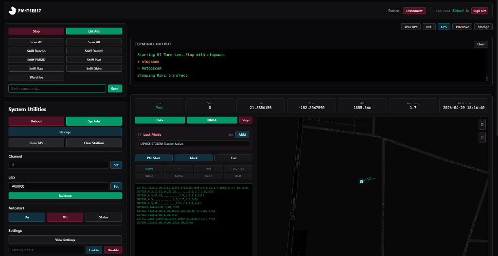
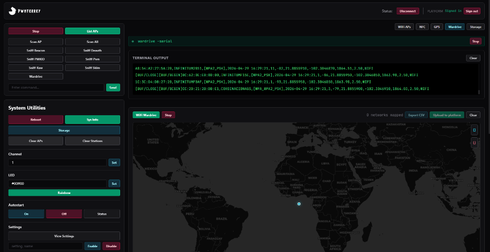
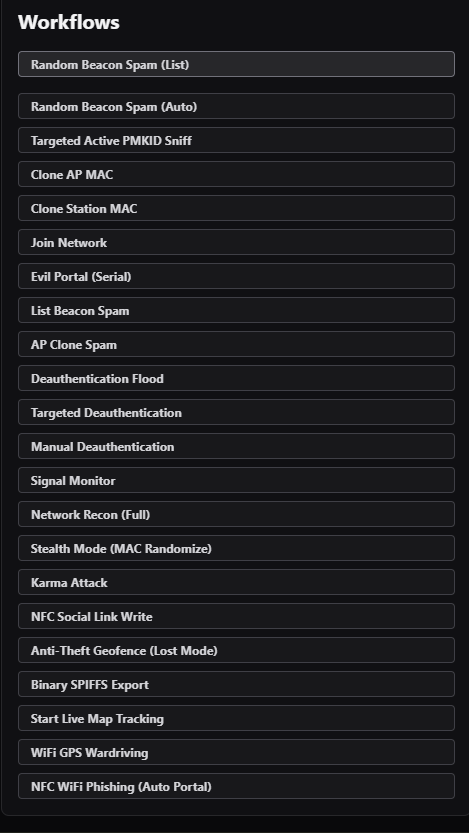
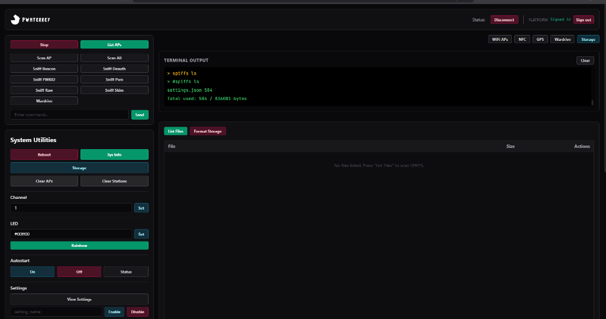
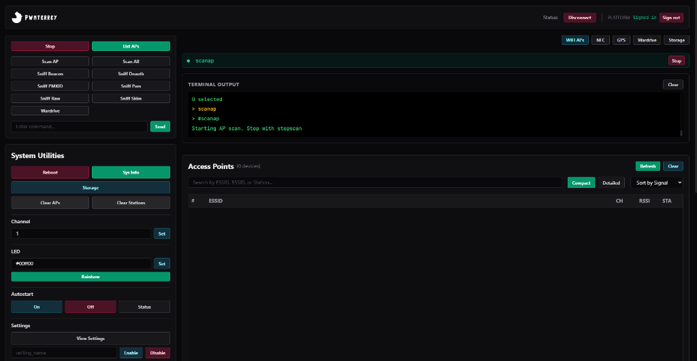

[FUNCION.md](https://github.com/user-attachments/files/27213160/FUNCION.md)
# 🛡️ PWNTERREY- Guía Completa

Esta guía detalla la instalación, configuración y modificación de hardware para el ecosistema **Marauder ESP32-C5** y su **UI Pro Dashboard**.

---

## 🌟 ¿Qué puedes hacer con tu Badge?

*   **Auditoría WiFi Avanzada**: Escaneo de puntos de acceso, detección de estaciones, ataques de desautenticación (solo en hardware compatible) y creación de **Beacons falsos** (Rick Roll, Mimic, etc.).
*   **Wardriving WiFi**: Combina el poder del WiFi con **GPS (NEO-6M)** para mapear redes en tiempo real, generando logs compatibles con WiGLE.
*   **Interacción Bluetooth (BLE)**: 
    *   **Ataques de Transmisión (Spamming)**: Realiza ataques de proximidad (Sour Apple, SwiftPair Spam, Google/Samsung Fast Pair) con alta estabilidad.
    *   **Nota Técnica (C5)**: Debido a las limitaciones de la arquitectura de un solo núcleo del ESP32-C5, las funciones de **recepción Bluetooth (Sniffing/BT Wardriving)** no están disponibles. El dispositivo destaca en la **transmisión** de ráfagas BLE.
*   **Gestión NFC**: Lectura y escritura de etiquetas NDEF, emulación de tarjetas y clonación básica para integración con otros dispositivos tácticos.
*   **Dashboard Marauder UI Pro**: Controla todo desde un navegador web de forma inalámbrica, visualiza telemetría GPS en vivo y descarga capturas PCAP directamente a tu PC.

---

## 💻 1. Inicialización del Dashboard (UI Pro)

El Dashboard es una aplicación web moderna que permite controlar el dispositivo visualmente.

1.  Abre una terminal (PowerShell o CMD) en la carpeta donde descargaste el proyecto.
2.  Entra en la carpeta de la interfaz:
    ```bash
    cd marauder-ui-pro
    ```
3.  Instala todas las dependencias (solo la primera vez):
    ```bash
    npm install
    ```
4.  Inicia el servidor local:
    ```bash
    npm run dev
    ```
5.  La terminal te dará una dirección (ej: `http://localhost:5173`). Ábrela en Google Chrome o Edge.
6.  En la web, haz clic en el botón **Connect**, selecciona el puerto COM de tu dispositivo y listo.

---

## 🛠️ 2. Configuración del Firmware

1.  Abre el archivo `esp32_marauder.ino` en Arduino IDE.
2.  Ve a la pestaña `configs.h`.
3.  Busca la sección `#define MARAUDER_FLIPPER_C5` (o el nombre de tu hardware específico) y asegúrate de que esté descomentado.
4.  Verifica los pines del GPS:
    ```cpp
    #define GPS_RX 4  // Verifica que coincida con el pad RX de tu placa
    #define GPS_TX 5  // Verifica que coincida con el pad TX de tu placa
    ```
5.  En el menú **Tools**, selecciona:
    *   **Board**: "ESP32-C5 Dev Module"
    *   **USB CDC On Boot**: "Enabled"
    *   **Core Debug Level**: "None" (Fundamental para estabilidad).
    *   **Flash Mode**: "DIO"
6.  Conecta tu Badge por USB y presiona **Upload**.

---

## ⚔️ 3. Operación y Ataques

### Bluetooth Spam (Optimizado para C5)
Esta versión es ultra-estable y no requiere reiniciar el dispositivo.
*   **Sour Apple**: Envía ráfagas de 400ms. Si los iPhones cercanos no muestran el pop-up, asegúrate de que el dispositivo esté a menos de 2 metros y deja el ataque corriendo 30 segundos.
*   **Swift Pair**: Funciona casi instantáneamente en laptops con Windows 10/11.

### Wardriving
1.  Inicia el comando `btwardrive` desde el Dashboard o la consola.
2.  Espera a que el indicador de GPS en la UI se ponga en **Verde (Good Fix)**.
3.  El dispositivo empezará a registrar todos los dispositivos Bluetooth cercanos y los guardará en la tarjeta SD (si está disponible) con su ubicación exacta.

---

## 🖥️ 4. Guía Operativa: Marauder UI Pro

El Dashboard está dividido en módulos tácticos. Aquí explicamos qué hace cada uno y cómo usarlos en una operación real.

### A. Panel de Control WiFi (WiFi Attacks)
Este módulo gestiona la radio de 2.4GHz para auditorías de red.
*   **Beacon Spam**: Permite inundar el espacio con cientos de redes falsas.
    *   *Workflow*: Selecciona una lista de SSIDs -> Configura la velocidad -> Dale a "Start".
*   **Deauth Attack**: Desconecta dispositivos de su red.
    *   *Workflow*: Escanea redes (AP Scan) -> Selecciona un objetivo -> Pulsa "Deauth". La UI mostrará el contador de paquetes enviados.
*   **Probe Request Sniffing**: Captura qué redes están buscando los celulares cercanos para identificar hábitos de conexión.

### B. Módulo Evil Portal (Phishing Táctico)
Es el workflow más potente para captura de credenciales.
1.  **Selección**: Elige un portal (Google, Starbucks, Genérico) desde la lista desplegable.
2.  **Despliegue**: Haz clic en "Start Portal". El dispositivo creará un AP abierto.
3.  **Monitoreo**: En la sección "Captured Data", verás en tiempo real los usuarios que se conectan y las contraseñas que ingresan.
4.  **NFC Sync**: (Exclusivo C5) Puedes grabar los datos del portal en el chip NFC del Badge para que, al acercar un teléfono, se abra el portal automáticamente.

### C. Workflow de Wardriving (Mapeo de Redes)
Este proceso combina el GPS con el escaneo de radio para crear mapas de calor.


*En la pestaña GPS puedes ver tu ubicación exacta, el número de satélites y activar el **Lost Mode** (Geofencing anti-robo).*


*Durante el Wardriving, el Dashboard muestra los dispositivos capturados en tiempo real sobre un mapa global.*

1.  **Activación GPS**: Ve a la pestaña GPS y asegúrate de tener "Good Fix" (LED Verde).
2.  **Inicio de Escaneo**: Selecciona "WiFi Wardrive".
3.  **Mapeo en Vivo**: Abre la pestaña **Map**. Verás cómo aparecen iconos en el mapa cada vez que se detecta un dispositivo.
4.  **Guardado**: Al terminar, usa `stopscan`. El log se guardará en la SD con formato compatible con Wigle.net.

### D. Ataques Bluetooth (BLE Spam) y Workflows
La UI Pro incluye una lista de flujos de trabajo automatizados para simplificar tareas complejas.


*El menú de Workflows permite lanzar ataques avanzados como **NFC Social Link Write**, **Karma Attack** y **Anti-Theft Geofence** con un solo clic.*

### E. Gestión de Archivos y Sistema
*   **Explorador de Archivos**: Permite ver los archivos `.pcap` y `.log` generados. Puedes descargarlos directamente a tu PC para analizarlos en Wireshark.


*Desde la pestaña **Storage** puedes listar el contenido de la memoria interna (SPIFFS) y descargar o borrar archivos.*

*   **Terminal Pro**: Envía comandos directos (`ls`, `help`, `set channel 11`). Es útil cuando necesitas una función muy específica que no tiene botón.


*El panel de **WiFi APs** te permite escanear y listar todas las redes cercanas para seleccionarlas como objetivo.*

---

## ⌨️ 5. Mapeo de Comandos e Interfaz

La UI traduce tus clics en estos comandos automáticos. Conocerlos te permite ser más rápido:

| Función en UI | Comando Equivalente | Uso Táctico |
| :--- | :--- | :--- |
| **Start Apple Spam** | `blespam -t apple` | Inundar iPhones con pop-ups de conexión. |
| **Start Windows Spam** | `blespam -t windows` | Activar "Swift Pair" en laptops cercanas. |
| **Start Wardriving** | `wardrive -serial` | Mapeo geográfico de dispositivos WiFi. |
| **Stop Activity** | `stopscan` | Detener cualquier proceso de radio de inmediato. |
| **Clear Terminal** | `clear` | Limpiar la pantalla de la consola. |
| **List Files** | `ls` | Ver botines capturados (credenciales/pcaps). |
| **GPS Status** | `gpsdata` | Verificar la salud de la antena NEO-6M. |

---
## 📋 6. Requerimientos de Software

Antes de empezar, debes descargar e instalar las siguientes herramientas:

### A. Para el Firmware (Arduino)
1.  **Arduino IDE**: Descarga la versión 2.3.0 o superior desde [arduino.cc](https://www.arduino.cc/en/software).
2.  **Core ESP32**: 
    *   En Arduino IDE, ve a `File` -> `Preferences`.
    *   En "Additional Boards Manager URLs", pega: `https://espressif.github.io/arduino-esp32/package_esp32_index.json`
    *   Ve a `Tools` -> `Board` -> `Boards Manager`, busca **esp32** e instala la versión **3.3.7**.
3.  **Librerías Necesarias**: Instala estas librerías desde el `Library Manager` (Ctrl+Shift+I):
    *   `NimBLE-Arduino` (Versión 1.4.1 o superior).
    *   `LinkedList` (por Ivan Seidel).
    *   `ArduinoJson` (Versión 7.x).
    *   `MicroNMEA` (Para el GPS).

### B. Para el Dashboard (Interfaz Web)
1.  **Node.js**: Descarga e instala la versión **LTS** desde [nodejs.org](https://nodejs.org/). Esto instalará automáticamente `npm`.

---
## 🛰️ 7. Guía de Hardware: Instalación de GPS (NEO-6M V2)

Muchos badges de Marauder C5 vienen sin GPS interno. Si tu placa tiene los pines expuestos (3.3V, GND, RX, TX), sigue estos pasos para instalar un módulo **u-blox NEO-6M V2**.

### Identificación de Pines en el Badge
Busca en tu placa la fila de 4 pads o agujeros marcados. Si no tienen marcas, la disposición estándar suele ser:
1.  **3.3V** (Alimentación)
2.  **GND** (Tierra)
3.  **RX** (Recepción de datos del ESP32)
4.  **TX** (Transmisión de datos al ESP32)

### Conexión Cruzada (¡IMPORTANTE!)
La conexión de datos debe ser cruzada para que el GPS pueda "hablar" con el ESP32:

| Pin Módulo GPS | Pin en el Badge | Nota |
| :--- | :--- | :--- |
| **VCC** | **3.3V** | No usar 5V, podrías quemar el Badge. |
| **GND** | **GND** | Conexión a tierra. |
| **TX** | **RX** | El TX del GPS envía los datos al RX del ESP32. |
| **RX** | **TX** | El ESP32 envía comandos de configuración al GPS. |

**Consejo de Soldadura:** Usa cables cortos para evitar interferencias electromagnéticas con la antena WiFi/BT del ESP32-C5.

---

## 🆘 Solución de Problemas Comunes

*   **El GPS no da señal**: El módulo NEO-6M necesita ver el cielo. Si estás en interiores, acércalo a una ventana. El primer "Fix" puede tardar hasta 10 minutos.
*   **Error al conectar el Dashboard**: Asegúrate de que el Monitor Serie de Arduino IDE esté **CERRADO**, ya que solo una aplicación puede usar el puerto COM a la vez.
*   **El Dashboard no carga**: Verifica que ejecutaste `npm install` correctamente y que no hay errores en la terminal.

---

---
 
## 🚀 Optimización y Modo Verbose (Serial)
 
En el ESP32-C5 (arquitectura de un solo núcleo), el modo **Verbose** (activado con el comando `verbose` o el flag `-serial`) no es solo para ver logs; es una herramienta de **regulación de rendimiento**.
 
#### ¿Cómo funciona?
Al realizar escaneos de alta intensidad (como Bluetooth Wardriving), la radio puede saturar el procesador. Al activar el modo Verbose:
1.  **Micro-pausas Tácticas**: Las impresiones por Serial introducen pequeños retardos (`Serial.flush()`) que permiten que el stack de la radio procese los paquetes acumulados.
2.  **Válvula de Escape**: Actúa como un regulador de presión para el buffer de la radio, evitando caídas de conexión o "Core Panics".
 
> [!TIP]
> Si estás en un entorno con cientos de dispositivos Bluetooth y notas inestabilidad, activa el modo **Verbose**. Esto sacrificará un poco de velocidad de refresco de pantalla a cambio de una captura de datos mucho más robusta y completa.
 
#### Comandos de Consola Útiles
*   `verbose`: Alterna el modo de logs detallados.
*   `settings -s SavePCAP enable`: Asegura que todas las capturas se guarden en la SD.
*   `ch -s <canal>`: Fija un canal específico para ataques dirigidos.

---

## 🆘 Solución de Problemas Comunes

*   **El GPS no da señal**: El módulo NEO-6M necesita ver el cielo. Si estás en interiores, acércalo a una ventana. El primer "Fix" puede tardar hasta 10 minutos.
*   **Error al conectar el Dashboard**: Asegúrate de que el Monitor Serie de Arduino IDE esté **CERRADO**, ya que solo una aplicación puede usar el puerto COM a la vez.
*   **El Dashboard no carga**: Verifica que ejecutaste `npm install` correctamente y que no hay errores en la terminal.

---
**Desarrollado para la comunidad de Seguridad Ofensiva.** 💀  
**created by ElectronicCats** 😼
